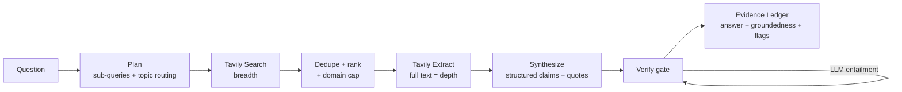

# Grounded — a verifiable research agent built on Tavily

> Web answers you can **audit, claim by claim** — not just trust.

Most search-agent demos end at "the model wrote an answer and listed some
URLs." In production — finance, legal, consulting, healthcare — that's exactly
where the *real* work starts, because the blocking question is **"can I trust
this, and prove it?"** Grounded is a small CLI that turns a question into an
answer where every claim is tied to a source passage, and a verification gate
checks that the passage actually supports the claim *before you see it*.

It's built around [Tavily](https://tavily.com)'s Search **and** Extract APIs,
LangChain 1.0, and OpenTelemetry tracing — and it ships with a reproducible
evaluation that measures the thing it claims to improve.

---

## The idea

The provided starter agent's real weakness isn't that it's "basic" — it's that
it produces **unverifiable** output. Its system prompt says *"include source
URLs when available"* and then trusts the model. That breaks two ways in the
field:

1. **Citation hallucination** — a real URL attached to a claim the URL doesn't
   support.
2. **Snippet-deep grounding** — `TavilySearch` returns ~200-character snippets;
   the model "grounds" on fragments and confabulates the gaps.

Grounded closes that trust gap with three moves, each going a step beyond the
obvious version:

| Move | What most demos do | What Grounded does |
|---|---|---|
| **Retrieval** | one `TavilySearch` at defaults | plan → **Search** (routed by topic/recency) → **Extract** full text of the best, deduplicated sources |
| **Citations** | "include URLs" in the prompt | structured **evidence ledger**: every claim → source id → *verbatim supporting quote* |
| **Trust** | hope | a **verification gate** that checks each quote is real *and* entailing, flags/caveats what fails, and reports a **groundedness score** |

---

## How it works



1. **Plan** — the model decomposes the question into focused sub-queries, each
   routed to the right Tavily `topic` (`news` / `finance` / `general`) with an
   optional `time_range`. Routing matters: time-sensitive queries hit the
   freshness-ranked indexes.
2. **Search → select** — every sub-query runs through Tavily Search; results
   are deduplicated by canonical URL, capped per domain (so corroboration
   beats repetition), and ranked.
3. **Extract** — the top sources go through **Tavily Extract** for full page
   text. *This is the key lever:* you cannot verify a claim against a snippet,
   only against the real passage.
4. **Synthesize** — using LangChain's structured output, the model returns a
   `DraftAnswer`: prose plus a list of atomic **claims**, each carrying the
   source id(s) and a **verbatim quote** it relies on.
5. **Verify** (the heart) — two cheap-first layers:
   - **Deterministic quote check** (no LLM): does the quote actually appear in
     the cited source? Catches fabricated quotes for free.
   - **LLM entailment** (only if the quote is real): does the quote *support*
     the claim, or did the model cite a real passage that says something else?
   Claims that fail are **flagged**, the answer **caveats** them instead of
   asserting them, and the whole thing is summarized as a **groundedness
   score**.
6. **Evidence ledger** — the auditable artifact returned alongside the answer
   (`--json`): question, answer, sources, per-claim verdicts, score, flags.

### Why an orchestrated pipeline (and not a free-form agent)?

This is a deliberate choice. The product's whole value is *auditable,
reproducible* answers, so determinism is a feature: each step is a discrete,
traced unit and the same question yields a comparable trace every time. The
natural next step — letting the model drive its own retrieval — is a
`create_agent` tool-loop with the verification step as **middleware**; that's a
clean extension point, not a prerequisite, and it would trade reproducibility
for autonomy. I chose the trade that serves the thesis.

---

## Observability

Every step is traced with **OpenTelemetry**, the converging vendor-neutral
standard for GenAI observability. LangChain calls are auto-instrumented via
[OpenInference](https://github.com/Arize-ai/openinference); the custom steps
(plan, each Tavily call, synthesize, verify) open their own spans with
attributes like result counts, source counts, and the final groundedness
score. Traces export to a local [Arize Phoenix](https://phoenix.arize.com/) UI
by default, or any OTLP backend via `PHOENIX_COLLECTOR_ENDPOINT`. No SaaS
signup, no lock-in.

```bash
uv run phoenix serve         # then open http://localhost:6006
uv run grounded "..."        # spans stream into Phoenix
```

---

## Evaluation

Claims about faithfulness should be measured, not asserted — so the repo
includes an offline eval (`eval/`) that pits Grounded against a faithful
re-creation of the naive starter (single search, snippets only, "please cite").
Both answers are scored by the **same independent judge**
(`eval/judge.py`) — reference-free, measuring the share of an answer's claims
its own sources actually support. Keeping the judge separate from the
pipeline's own verifier keeps measurement honest.

```bash
uv run python eval/run_eval.py            # full 12-question set
uv run python eval/run_eval.py --limit 3  # quick smoke
```

**Results** _(latest run — `eval/results/*.json`)_:

<!-- RESULTS:START -->
> _Populated by `eval/run_eval.py`. Run it with your keys to reproduce; the
> headline metrics are groundedness (↑), citation quality (↑), fabricated
> quotes caught, and claims caveated rather than asserted._
<!-- RESULTS:END -->

---

## Quickstart

Requires [`uv`](https://docs.astral.sh/uv/) and Python ≥ 3.11.

```bash
# 1. Configure keys (see .env.example) — this repo ships configured for Nebius:
cat > .env <<'EOF'
TAVILY_API_KEY=tvly-...
NEBIUS_API_KEY=...
GROUNDED_PROVIDER=nebius
EOF

# 2. Install
uv sync --extra nebius        # or: uv sync   (Anthropic/Claude is the default provider)

# 3. Ask
uv run grounded "What changed in the AI search market this year?"
uv run grounded --json "..."        # full evidence ledger
uv run grounded --no-verify "..."   # deterministic quote-check only (no judge calls)
uv run grounded --baseline "..."    # naive starter-style answer, for contrast

# 4. Test & evaluate
uv run pytest -q
uv run python eval/run_eval.py --limit 3
```

**Provider:** defaults to Anthropic Claude (`claude-opus-4-8`); set
`GROUNDED_PROVIDER=nebius` (+ `NEBIUS_API_KEY`) to use the starter's
Nebius-hosted open models. Override the model with `GROUNDED_MODEL`.

---

## Project layout

```
src/grounded/
  schemas.py        Pydantic models — the evidence-ledger contract
  config.py         settings + provider-flexible model construction
  retrieval.py      two-stage Tavily Search → dedupe → Extract (pure parts unit-tested)
  pipeline.py       plan → retrieve → synthesize → research(); + baseline for eval
  verify.py         the verification gate (deterministic quote check + LLM entailment)
  observability.py  OpenTelemetry / OpenInference / Phoenix setup
  cli.py            the `grounded` CLI (rich rendering of answer + ledger)
eval/               dataset + independent judge + grounded-vs-baseline runner
tests/              pure-logic tests (dedup, quote-matching, ledger) — no keys needed
```

---

## Limitations & next steps

- **Verifier cost/latency** — one judge call per claim. A batched judge (all
  claims in one call) and caching would cut this materially.
- **Extraction coverage** — paywalled/JS-heavy pages can return thin text;
  Tavily Extract's `advanced` depth helps, and Tavily Crawl could deepen
  coverage for known sources.
- **Self-judging in eval** — when judge and answerer share a model family there
  is a mild bias; set `GROUNDED_JUDGE_MODEL` to a different model for a stricter
  read.
- **Agentic variant** — the `create_agent` + verification-middleware version
  described above, for tasks that benefit from model-driven retrieval.
```
