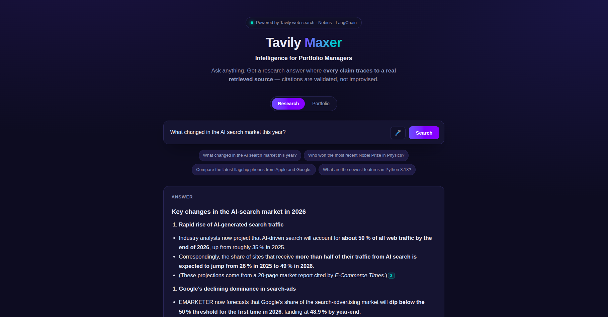
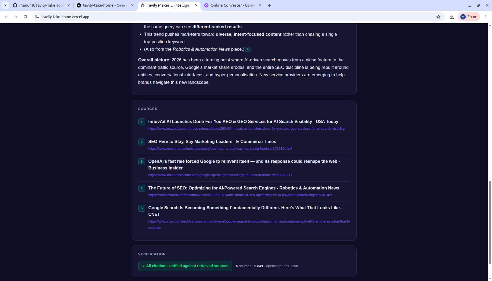
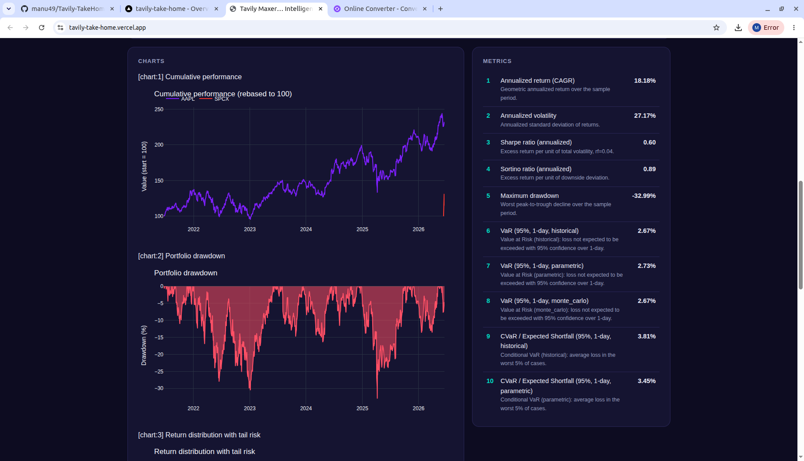

# Tavily Maxer — Intelligence for Portfolio Managers

**Live app: https://tavily-take-home.vercel.app/**

## Demo

<video src="https://github.com/manu49/Tavily-TakeHome/raw/main/Demo/v3_Tavily_Maxer.mp4" controls width="100%"></video>

> If the player doesn't load inline, [watch/download the demo video](Demo/v3_Tavily_Maxer.mp4).

A productionized research-and-analytics web app for **portfolio managers**. Ask the web a
question and get an answer where **every claim traces to a real, retrieved source**, or
upload a portfolio and get **code-computed** risk/return analytics with interactive charts.
In finance, precise and verifiable data is critical — so nothing here is improvised by the
model: citations are validated against what Tavily actually returned, and every metric is
computed in code, never estimated by the LLM.

This started as the take-home's [`legacy/starter_agent.py`](legacy/starter_agent.py) — a
bare agent that searched the web but couldn't prove its answers (it emitted citation-like
markers that pointed at nothing). It grew into a deployed, validated, observable product:
grounded citations, a portfolio-analytics tool, a single-page web UI, optional voice input,
and a Vercel deployment. The full arc is in
[`docs/improvements.md`](docs/improvements.md) and
[`docs/developmental_stages.md`](docs/developmental_stages.md).

## Tech stack

- **Python** — agent, analytics, and web server (standard-library `http.server`; no web
  framework, so the dependency footprint stays small).
- **Tavily** — web search; results are deduped and assigned code-owned source IDs so the
  model can only cite things that were actually retrieved.
- **LangChain** (`create_agent`, structured output) + **Nebius** — the ReAct agent loop and
  LLM synthesis, with a structured `ResearchAnswer` schema that forces inline `[n]`
  citations.
- **NumPy / pandas / yfinance / Plotly** — the portfolio engine: live prices, in-house
  risk/return quant (annualized return, volatility, Sharpe, etc.), and interactive charts.
  See [`docs/portfolio_analysis_design.md`](docs/portfolio_analysis_design.md).
- **ElevenLabs** — optional speech-to-text for voice input (server-side, key never reaches
  the browser).
- **Vercel** — hosting; the whole app deploys from one WSGI entrypoint (`webapp:app`).
- **LangSmith** — optional tracing/observability, with a local `logs/runs.jsonl` fallback.

## How to use

Open the [live app](https://tavily-take-home.vercel.app/) (or run it locally — see
[`docs/setup.md`](docs/setup.md)).

### 1. Research mode

Ask any question and get a grounded, cited answer with a ✓/✗ validation badge and a numbered
Sources panel. Try the sample question in [`Demo/research.txt`](Demo/research.txt):

> Pick top 10 best ETFs for investing in AI in 2026.

Paste it into the box, hit **Search**, and click any `[n]` citation chip to jump to its
source.

### 2. Portfolio mode

Switch to **Portfolio**, upload [`Demo/AAPL_SPCX.csv`](Demo/AAPL_SPCX.csv) (a holdings file
with ticker and dollar amounts — AAPL and SPCX; weights are derived from market value), and
enter a prompt like:

> Analyse my portfolio over the last 5 years

You get code-computed headline metrics (return, volatility, Sharpe), interactive charts, and
a validation badge confirming every number was computed — not estimated by the model.

### 3. Voice input (optional)

Click the 🎤 mic to **dictate** your question instead of typing. The browser records audio,
the server transcribes it via **ElevenLabs** speech-to-text, and the transcript drops into
the box for you to review and run. Enabled when `ELEVENLABS_API_KEY` is set; needs a secure
(HTTPS/localhost) context.

## Setup & deployment

Running locally, the required API keys, tests, and deploying your own copy to Vercel are all
covered in **[`docs/setup.md`](docs/setup.md)**.

## Project layout

| Path | What |
|---|---|
| [`tavily_maxer.py`](tavily_maxer.py) | The research agent — search, structured citations, validation, tracing. |
| [`webapp.py`](webapp.py) | The web app: WSGI `app` (Vercel entrypoint) + inlined UI + local dev server. |
| [`lib/`](lib/) | Supporting modules: portfolio parsing, quant, charts, market data, artifacts. |
| [`docs/`](docs/) | [setup](docs/setup.md) · [design/rationale](docs/improvements.md) · [dev log](docs/developmental_stages.md) · [portfolio design](docs/portfolio_analysis_design.md) |
| [`Demo/`](Demo/) | Sample inputs for the two modes. |
| [`tests/`](tests/), [`evals/`](evals/) | Offline unit tests and live sample/eval runs. |
| [`legacy/`](legacy/) | The original `starter_agent.py` this project grew from. |
